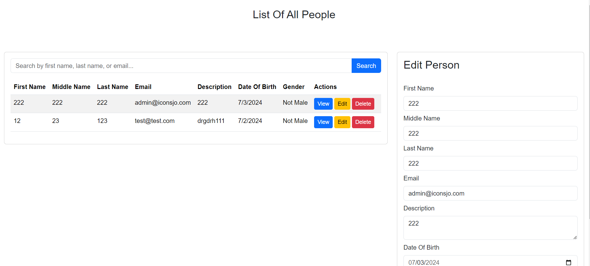

<!-- Clone this repository using bash terminal: -->

    git clone https://github.com/osamaSale/11-Iconsjo

<!--End clone area -->

## stabilizing

1. **Clone Repository:**

 ``` bash
 Git clone https://github.com/osamaSale/11-Iconsjo

2. **Start the client:**

 ``` bash
 cd./11-Iconsjo
 npm install
 npm start
 ```

